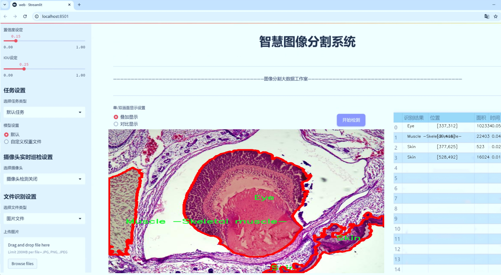
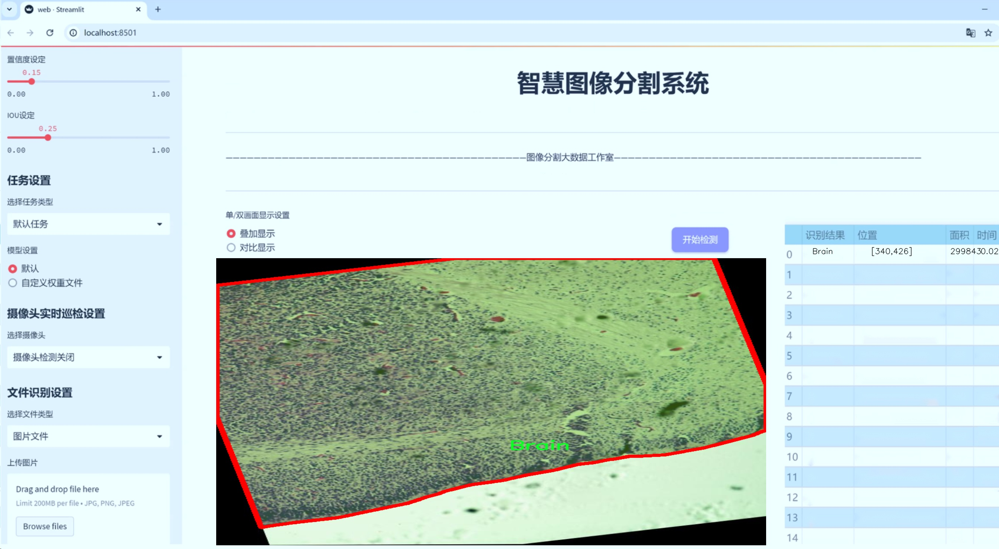
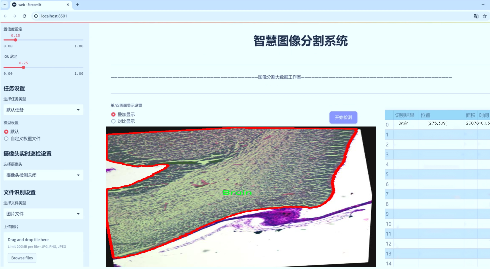
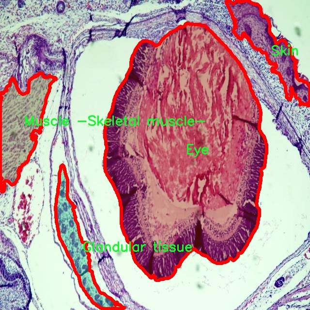
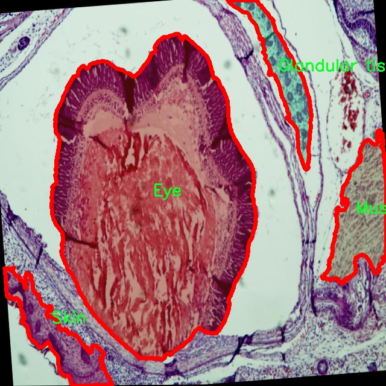
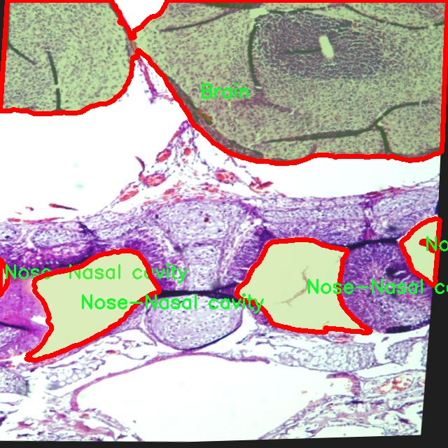
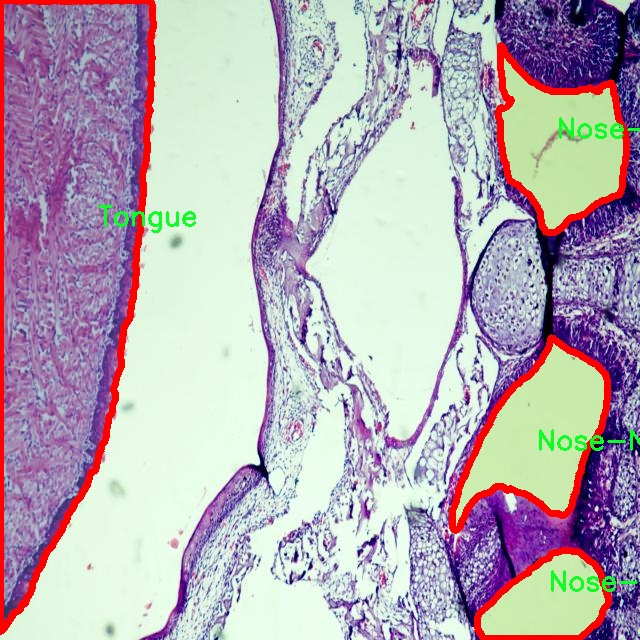
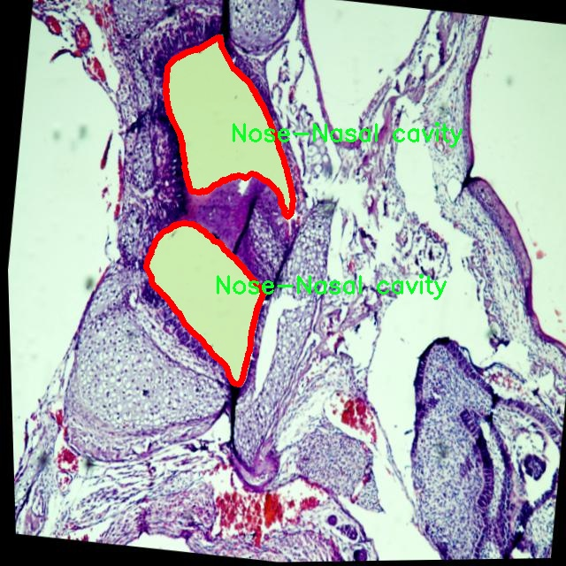

# 医学影像分割系统源码＆数据集分享
 [yolov8-seg-dyhead-DCNV3＆yolov8-seg-RevCol等50+全套改进创新点发刊_一键训练教程_Web前端展示]

### 1.研究背景与意义

项目参考[ILSVRC ImageNet Large Scale Visual Recognition Challenge](https://gitee.com/YOLOv8_YOLOv11_Segmentation_Studio/projects)

项目来源[AAAI Global Al lnnovation Contest](https://kdocs.cn/l/cszuIiCKVNis)

研究背景与意义

随着医学影像技术的迅速发展，医学影像在疾病诊断、治疗规划和术后评估等方面发挥着越来越重要的作用。尤其是在精准医疗的背景下，如何高效、准确地对医学影像进行分析与解读，成为了医学研究和临床应用中的一项关键任务。传统的医学影像分析方法往往依赖于人工标注和经验判断，存在主观性强、效率低下等问题。因此，基于深度学习的自动化医学影像分割技术应运而生，成为当前研究的热点之一。

YOLO（You Only Look Once）系列模型以其高效的实时目标检测能力，逐渐被应用于医学影像分析中。YOLOv8作为该系列的最新版本，具备更强的特征提取能力和更快的推理速度，为医学影像分割提供了新的技术支持。然而，现有的YOLOv8模型在医学影像分割任务中仍面临一些挑战，如对小目标的检测能力不足、对复杂背景的适应性差等。因此，改进YOLOv8模型以提高其在医学影像分割中的性能，具有重要的研究意义。

本研究基于FYP-Relabel数据集，涵盖了2600幅医学影像，涉及27个类别，包括血块、骨骼、脑组织、心脏、肝脏、肺部等多种重要器官和组织。这些类别的多样性为模型的训练提供了丰富的样本，能够有效提升模型的泛化能力和适应性。通过对这些医学影像进行实例分割，不仅可以实现对不同组织和器官的精确定位，还能够为临床医生提供更为直观的影像信息，辅助其进行更为准确的诊断和治疗决策。

此外，改进YOLOv8模型的研究还将推动医学影像分析领域的技术进步。通过引入先进的深度学习技术和优化算法，可以有效提升模型在医学影像分割任务中的表现，进而推动相关领域的研究与应用。例如，在肿瘤检测和分割方面，准确的影像分割能够帮助医生更好地评估肿瘤的大小、形状及其与周围组织的关系，为制定个性化的治疗方案提供重要依据。

综上所述，基于改进YOLOv8的医学影像分割系统的研究，不仅具有重要的理论价值，也具有广泛的应用前景。通过对医学影像进行高效、准确的分割，能够显著提升医学影像分析的自动化水平，推动精准医疗的发展，为患者提供更为优质的医疗服务。因此，本研究的开展具有重要的学术意义和社会价值。

### 2.图片演示







##### 注意：由于此博客编辑较早，上面“2.图片演示”和“3.视频演示”展示的系统图片或者视频可能为老版本，新版本在老版本的基础上升级如下：（实际效果以升级的新版本为准）

  （1）适配了YOLOV8的“目标检测”模型和“实例分割”模型，通过加载相应的权重（.pt）文件即可自适应加载模型。

  （2）支持“图片识别”、“视频识别”、“摄像头实时识别”三种识别模式。

  （3）支持“图片识别”、“视频识别”、“摄像头实时识别”三种识别结果保存导出，解决手动导出（容易卡顿出现爆内存）存在的问题，识别完自动保存结果并导出到tempDir中。

  （4）支持Web前端系统中的标题、背景图等自定义修改，后面提供修改教程。

  另外本项目提供训练的数据集和训练教程,暂不提供权重文件（best.pt）,需要您按照教程进行训练后实现图片演示和Web前端界面演示的效果。

### 3.视频演示

[3.1 视频演示](https://www.bilibili.com/video/BV1QvmKYFEdr/)

### 4.数据集信息展示

##### 4.1 本项目数据集详细数据（类别数＆类别名）

nc: 27
names: ['Blood clot', 'Bones-Cartilage', 'Brain', 'Brown adipose', 'Chyme -non-tissue-', 'Esophagus', 'Eye', 'Ganglionic structure', 'Gastrointestinal segment', 'Glandular tissue', 'Heart -Cardiac muscle-', 'Kidney', 'Liver', 'Lungs', 'Muscle -Skeletal muscle-', 'Muscle -Smooth muscle-', 'Nose-Nasal cavity', 'Pancreas', 'Peripheral nerves', 'Skin', 'Spinal-cord', 'Spleen', 'Thymus', 'Tongue', 'Trachea', 'Unidentified', 'White adipose']


##### 4.2 本项目数据集信息介绍

数据集信息展示

在医学影像分析领域，数据集的质量和多样性直接影响到模型的训练效果和最终的应用性能。本研究所采用的“FYP-Relabel”数据集，专门为改进YOLOv8-seg的医学影像分割系统而设计，涵盖了27个不同的类别，能够有效支持多种医学影像的分割任务。该数据集的类别列表包括了诸如“Blood clot”（血块）、“Bones-Cartilage”（骨骼-软骨）、“Brain”（大脑）、“Heart -Cardiac muscle-”（心脏-心肌）等重要的生物组织和结构，充分体现了医学影像分析的复杂性和多样性。

“FYP-Relabel”数据集的构建过程经过精心设计，确保了每个类别的标注准确性和一致性。这一数据集不仅包含了常见的器官和组织，还涵盖了一些较为特殊的生物结构，如“Ganglionic structure”（神经节结构）和“Peripheral nerves”（外周神经），这些类别的引入为模型的训练提供了更为全面的视角，使得模型在处理复杂的医学影像时能够具备更强的分割能力。此外，数据集中还包括了“Unidentified”（未识别）这一类别，旨在帮助模型学习如何处理那些在训练数据中未被明确标注的结构，从而提升其在实际应用中的鲁棒性。

在数据集的规模和多样性方面，“FYP-Relabel”提供了丰富的样本，这些样本涵盖了不同的成像技术和不同的病理状态。这种多样性不仅有助于模型学习到更为广泛的特征，也能够有效减少过拟合的风险，使得模型在面对新样本时表现出更好的泛化能力。通过对这些类别的细致划分，研究人员能够更清晰地分析模型在不同组织和结构上的表现，从而为后续的优化提供有价值的反馈。

为了确保数据集的实用性和科学性，“FYP-Relabel”在数据采集和标注过程中遵循了严格的伦理标准和技术规范，所有影像均来自于经过伦理审查的医疗机构，标注工作则由经验丰富的医学影像专家完成。这一过程不仅提升了数据集的可信度，也为后续的研究提供了坚实的基础。

综上所述，“FYP-Relabel”数据集以其丰富的类别、准确的标注和多样的样本，为改进YOLOv8-seg的医学影像分割系统提供了强有力的支持。通过对该数据集的深入研究和应用，研究人员希望能够推动医学影像分析技术的发展，最终实现更为精准的疾病诊断和治疗方案。随着技术的不断进步，未来的研究将进一步探索如何利用这一数据集来提升模型的性能，推动医学影像分割领域的创新与发展。











### 5.全套项目环境部署视频教程（零基础手把手教学）

[5.1 环境部署教程链接（零基础手把手教学）](https://www.bilibili.com/video/BV1jG4Ve4E9t/?vd_source=bc9aec86d164b67a7004b996143742dc)


[5.2 安装Python虚拟环境创建和依赖库安装视频教程链接（零基础手把手教学）](https://www.bilibili.com/video/BV1nA4VeYEze/?vd_source=bc9aec86d164b67a7004b996143742dc)

### 6.手把手YOLOV8-seg训练视频教程（零基础小白有手就能学会）

[6.1 手把手YOLOV8-seg训练视频教程（零基础小白有手就能学会）](https://www.bilibili.com/video/BV1cA4VeYETe/?vd_source=bc9aec86d164b67a7004b996143742dc)


按照上面的训练视频教程链接加载项目提供的数据集，运行train.py即可开始训练



     Epoch   gpu_mem       box       obj       cls    labels  img_size
     1/200     0G   0.01576   0.01955  0.007536        22      1280: 100%|██████████| 849/849 [14:42<00:00,  1.04s/it]
               Class     Images     Labels          P          R     mAP@.5 mAP@.5:.95: 100%|██████████| 213/213 [01:14<00:00,  2.87it/s]
                 all       3395      17314      0.994      0.957      0.0957      0.0843

     Epoch   gpu_mem       box       obj       cls    labels  img_size
     2/200     0G   0.01578   0.01923  0.007006        22      1280: 100%|██████████| 849/849 [14:44<00:00,  1.04s/it]
               Class     Images     Labels          P          R     mAP@.5 mAP@.5:.95: 100%|██████████| 213/213 [01:12<00:00,  2.95it/s]
                 all       3395      17314      0.996      0.956      0.0957      0.0845

     Epoch   gpu_mem       box       obj       cls    labels  img_size
     3/200     0G   0.01561    0.0191  0.006895        27      1280: 100%|██████████| 849/849 [10:56<00:00,  1.29it/s]
               Class     Images     Labels          P          R     mAP@.5 mAP@.5:.95: 100%|███████   | 187/213 [00:52<00:00,  4.04it/s]
                 all       3395      17314      0.996      0.957      0.0957      0.0845


### 7.50+种全套YOLOV8-seg创新点代码加载调参视频教程（一键加载写好的改进模型的配置文件）

[7.1 50+种全套YOLOV8-seg创新点代码加载调参视频教程（一键加载写好的改进模型的配置文件）](https://www.bilibili.com/video/BV1Hw4VePEXv/?vd_source=bc9aec86d164b67a7004b996143742dc)

### 8.YOLOV8-seg图像分割算法原理

原始YOLOV8-seg算法原理

YOLO（You Only Look Once）系列算法自2015年首次提出以来，经历了多个版本的迭代与优化，最新的YOLOv8-seg算法不仅在目标检测领域取得了显著的进展，同时也在图像分割任务中展现了其强大的能力。YOLOv8-seg的设计理念基于其前身的成功经验，旨在提供更快的推理速度和更高的精度，同时增强模型的可训练性和适应性。该算法的核心结构可以分为三个主要部分：Backbone、Neck和Head，每个部分都在整体性能的提升中扮演着至关重要的角色。

在YOLOv8-seg中，Backbone负责特征提取，采用了CSP（Cross Stage Partial）结构，以提高特征提取的效率和准确性。CSP结构将特征提取过程分为两个部分，分别进行卷积和连接，从而实现更丰富的特征表示。通过这种方式，YOLOv8-seg能够有效地捕捉到图像中的细节信息，尤其是在复杂场景下的目标特征。值得注意的是，YOLOv8-seg还引入了C2f模块，替代了YOLOv5中的C3模块，进一步增强了特征流动性和梯度传播能力，使得网络在训练过程中能够更好地收敛。

Neck部分则采用了双塔结构，结合了特征金字塔网络（FPN）和路径聚合网络（PAN），以实现多尺度特征的融合。这种设计不仅增强了网络对不同尺度目标的检测能力，还促进了语义信息与定位信息的有效转移。通过特征融合，YOLOv8-seg能够在处理复杂场景时，充分利用各层特征，提升模型的整体表现。尤其是在图像分割任务中，Neck部分的设计使得模型能够更好地理解图像的上下文信息，从而提高分割的精度。

在Head部分，YOLOv8-seg采用了解耦头结构，分别处理回归和分类任务。这种结构的引入，使得模型在进行目标检测和分割时，能够更加高效地进行信息处理，减少了不同任务之间的干扰。通过将回归分支和预测分支分离，YOLOv8-seg能够加速模型的收敛过程，提升训练效率。同时，YOLOv8-seg还采用了Anchor-Free的检测方式，简化了目标检测的过程，使得模型在处理复杂背景和多目标场景时，表现得更加稳健。

YOLOv8-seg的另一个重要特点是其灵活的模型设置。模型的深度、宽度和通道数可以通过depth_factor、width_factor和ratio等参数进行调整，以适应不同的应用场景和硬件条件。这种灵活性使得YOLOv8-seg能够在各种设备上运行，从高性能的GPU到资源受限的边缘设备，都能实现良好的性能表现。此外，YOLOv8-seg原生支持自定义数据集，使得用户可以根据具体需求进行训练和优化，进一步提升模型的适用性。

在实际应用中，YOLOv8-seg的推理速度和精度都得到了显著提升，成为了当前业界最流行和成功的模型之一。通过Mosaic增强和瞄点计算等预处理技术，YOLOv8-seg能够有效地提高模型对图像的理解能力，进而提升检测和分割的效果。这些技术的结合，使得YOLOv8-seg在面对复杂的视觉任务时，依然能够保持高效的性能。

总的来说，YOLOv8-seg算法通过其创新的网络结构和灵活的模型设置，成功地将目标检测与图像分割任务结合在一起，展现了强大的应用潜力。无论是在工业检测、自动驾驶还是医疗影像分析等领域，YOLOv8-seg都能够提供高效、准确的解决方案。随着YOLOv8-seg的不断发展与优化，未来的视觉任务将迎来更多的可能性与挑战。


### 9.系统功能展示（检测对象为举例，实际内容以本项目数据集为准）

图9.1.系统支持检测结果表格显示

  图9.2.系统支持置信度和IOU阈值手动调节

  图9.3.系统支持自定义加载权重文件best.pt(需要你通过步骤5中训练获得)

  图9.4.系统支持摄像头实时识别

  图9.5.系统支持图片识别

  图9.6.系统支持视频识别

  图9.7.系统支持识别结果文件自动保存

  图9.8.系统支持Excel导出检测结果数据


### 10.50+种全套YOLOV8-seg创新点原理讲解（非科班也可以轻松写刊发刊，V11版本正在科研待更新）

#### 10.1 由于篇幅限制，每个创新点的具体原理讲解就不一一展开，具体见下列网址中的创新点对应子项目的技术原理博客网址【Blog】：


[10.1 50+种全套YOLOV8-seg创新点原理讲解链接](https://gitee.com/qunmasj/good)

#### 10.2 部分改进模块原理讲解(完整的改进原理见上图和技术博客链接)【如果此小节的图加载失败可以通过CSDN或者Github搜索该博客的标题访问原始博客，原始博客图片显示正常】
### YOLOv8简介

YOLOv8是一种最新的SOTA算法，提供了N/S/M/L/X尺度的不同大小模型，以满足不同场景的需求。本章对算法网络的新特性进行简要介绍。


1）骨干网络和Neck
开发者设计了C2f模块对CSPDarkNet 53和PAFPN进行改造。相比C3模块，C2f模块拥有更多的分支跨层链接，使模型的梯度流更加丰富，显著增强了模型的特征提取能力。
2)Head部分
Head部分采用无锚框设计，将分类任务和回归任务进行了解耦，独立的分支将更加专注于其所负责的特征信息。
3）损失计算
模型使用CIOU Loss作为误差损失函数，并通过最小化DFL进一步提升边界框的回归精度。同时模型采用了TaskAlignedAssigner样本分配策略，以分类得分和IOU的高阶组合作为指标指导正负样本选择，实现了高分类得分和高IOU的对齐，有效地提升了模型的检测精度。


### D-LKA Attention简介
自2010年代中期以来，卷积神经网络（CNNs）已成为许多计算机视觉应用的首选技术。它们能够从原始数据中自动提取复杂的特征表示，无需手动进行特征工程，这引起了医学图像分析社区的极大兴趣。许多成功的CNN架构，如U-Net、全卷积网络、DeepLab或SegCaps（分割胶囊），已经被开发出来。这些架构在语义分割任务中取得了巨大成功，先前的最新方法已经被超越。

在计算机视觉研究中，不同尺度下的目标识别是一个关键问题。在CNN中，可检测目标的大小与相应网络层的感受野尺寸密切相关。如果一个目标扩展到超出这个感受野的边界，这可能会导致欠分割结果。相反，与目标实际大小相比使用过大的感受野可能会限制识别，因为背景信息可能会对预测产生不必要的影响。

解决这个问题的一个有希望的方法涉及在并行使用具有不同尺寸的多个Kernel，类似于Inception块的机制。然而，由于参数和计算要求的指数增长，将Kernel大小增加以容纳更大的目标在实践中受到限制。因此，出现了各种策略，包括金字塔池化技术和不同尺度的扩张卷积，以捕获多尺度的上下文信息。

另一个直观的概念涉及将多尺度图像金字塔或它们的相关特征表示直接纳入网络架构。然而，这种方法存在挑战，特别是在管理训练和推理时间方面的可行性方面存在挑战。在这个背景下，使用编码器-解码器网络，如U-Net，已被证明是有利的。这样的网络在较浅的层中编码外观和位置，而在更深的层中，通过神经元的更广泛的感受野捕获更高的语义信息和上下文信息。

一些方法将来自不同层的特征组合在一起，或者预测来自不同尺寸的层的特征以使用多尺度的信息。此外，出现了从不同尺度的层中预测特征的方法，有效地实现了跨多个尺度的见解整合。然而，大多数编码器-解码器结构面临一个挑战：它们经常无法在不同尺度之间保持一致的特征，并主要使用最后一个解码器层生成分割结果。

语义分割是一项任务，涉及根据预定义的标签集为图像中的每个像素预测语义类别。这项任务要求提取高级特征同时保留初始的空间分辨率。CNNs非常适合捕获局部细节和低级信息，尽管以忽略全局上下文为代价。视觉Transformer（ViT）架构已经成为解决处理全局信息的视觉任务的关键，包括语义分割，取得了显著的成功。

ViT的基础是注意力机制，它有助于在整个输入序列上聚合信息。这种能力使网络能够合并远程的上下文提示，超越了CNN的有限感受野尺寸。然而，这种策略通常会限制ViT有效建模局部信息的能力。这种局限可能会妨碍它们检测局部纹理的能力，这对于各种诊断和预测任务至关重要。这种缺乏局部表示可以归因于ViT模型处理图像的特定方式。

ViT模型将图像分成一系列Patch，并使用自注意力机制来模拟它们之间的依赖关系。这种方法可能不如CNN模型中的卷积操作对感受野内提取局部特征有效。ViT和CNN模型之间的这种图像处理方法的差异可能解释了CNN模型在局部特征提取方面表现出色的原因。

近年来，已经开发出创新性方法来解决Transformer模型内部局部纹理不足的问题。其中一种方法是通过互补方法将CNN和ViT特征结合起来，以结合它们的优势并减轻局部表示的不足。TransUNet是这种方法的早期示例，它在CNN的瓶颈中集成了Transformer层，以模拟局部和全局依赖关系。HiFormer提出了一种解决方案，将Swin Transformer模块和基于CNN的编码器结合起来，生成两个多尺度特征表示，通过Double-Level Fusion模块集成。UNETR使用基于Transformer的编码器和CNN解码器进行3D医学图像分割。CoTr和TransBTS通过Transformer在低分辨率阶段增强分割性能，将CNN编码器和解码器连接在一起。

增强局部特征表示的另一种策略是重新设计纯Transformer模型内部的自注意力机制。在这方面，Swin-Unet在U形结构中集成了一个具有线性计算复杂性的Swin Transformer块作为多尺度 Backbone 。MISSFormer采用高效Transformer来解决视觉Transformer中的参数问题，通过在输入块上进行不可逆的降采样操作。D-Former引入了一个纯Transformer的管道，具有双重注意模块，以分段的方式捕获细粒度的局部注意和与多元单元的交互。然而，仍然存在一些特定的限制，包括计算效率低下，如TransUNet模型所示，对CNN Backbone 的严重依赖，如HiFormer所观察到的，以及对多尺度信息的忽略。

此外，目前的分割架构通常采用逐层处理3D输入 volumetric 的方法，无意中忽视了相邻切片之间的潜在相关性。这一疏忽限制了对 volumetric 信息的全面利用，因此损害了定位精度和上下文集成。此外，必须认识到，医学领域的病变通常在形状上发生变形。因此，用于医学图像分析的任何学习算法都必须具备捕捉和理解这些变形的能力。与此同时，该算法应保持计算效率，以便处理3D volumetric数据。

为了解决上述提到的挑战，作者提出了一个解决方案，即可变形大卷积核注意力模块（Deformable LKA module），它是作者网络设计的基本构建模块。这个模块明确设计成在有效处理上下文信息的同时保留局部描述符。作者的架构在这两个方面的平衡增强了实现精确语义分割的能力。

值得注意的是，参考该博客引入了一种基于数据的感受野的动态适应，不同于传统卷积操作中的固定滤波器Mask。这种自适应方法使作者能够克服与静态方法相关的固有限制。这种创新方法还扩展到了D-LKA Net架构的2D和3D版本的开发。

在3D模型的情况下，D-LKA机制被量身定制以适应3D环境，从而实现在不同 volumetric 切片之间无缝信息交互。最后，作者的贡献通过其计算效率得到进一步强调。作者通过仅依靠D-LKA概念的设计来实现这一点，在各种分割基准上取得了显著的性能，确立了作者的方法作为一种新的SOTA方法。

在本节中，作者首先概述方法论。首先，作者回顾了由Guo等人引入的大卷积核注意力（Large Kernel Attention，LKA）的概念。然后，作者介绍了作者对可变形LKA模块的创新探索。在此基础上，作者介绍了用于分割任务的2D和3D网络架构。

大卷积核提供了与自注意力机制类似的感受野。可以通过使用深度卷积、深度可扩展卷积和卷积来构建大卷积核，从而减少了参数和计算量。构建输入维度为和通道数的卷积核的深度卷积和深度可扩展卷积的卷积核大小的方程如下：


具有卷积核大小和膨胀率。参数数量和浮点运算（FLOPs）的计算如下：


FLOPs的数量与输入图像的大小成线性增长。参数的数量随通道数和卷积核大小的增加而呈二次增长。然而，由于它们通常都很小，因此它们不是限制因素。

为了最小化对于固定卷积核大小K的参数数量，可以将方程3对于膨胀率的导数设定为零：


例如，当卷积核大小为时，结果是。将这些公式扩展到3D情况是直接的。对于大小为和通道数C的输入，3D情况下参数数量和FLOPs 的方程如下：


具有卷积核大小和膨胀。


利用大卷积核进行医学图像分割的概念通过引入可变形卷积得以扩展。可变形卷积可以通过整数偏移自由调整采样网格以进行自由变形。额外的卷积层从特征图中学习出变形，从而创建一个偏移场。基于特征本身学习变形会导致自适应卷积核。这种灵活的卷积核形状可以提高病变或器官变形的表示，从而增强了目标边界的定义。

负责计算偏移的卷积层遵循其相应卷积层的卷积核大小和膨胀。双线性插值用于计算不在图像网格上的偏移的像素值。如图2所示，D-LKA模块可以表示为：


其中输入特征由表示，。表示为注意力图，其中每个值表示相应特征的相对重要性。运算符  表示逐元素乘法运算。值得注意的是，LKA不同于传统的注意力方法，它不需要额外的规范化函数，如或。这些规范化函数往往忽视高频信息，从而降低了基于自注意力的方法的性能。

在该方法的2D版本中，卷积层被可变形卷积所替代，因为可变形卷积能够改善对具有不规则形状和大小的目标的捕捉能力。这些目标在医学图像数据中常常出现，因此这种增强尤为重要。

然而，将可变形LKA的概念扩展到3D领域会带来一定的挑战。主要的约束来自于需要用于生成偏移的额外卷积层。与2D情况不同，由于输入和输出通道的性质，这一层无法以深度可分的方式执行。在3D环境中，输入通道对应于特征，而输出通道扩展到，其中是卷积核的大小。大卷积核的复杂性导致沿第3D的通道数扩展，导致参数和FLOPs大幅增加。因此，针对3D情况采用了另一种替代方法。在现有的LKA框架中，深度卷积之后引入了一个单独的可变形卷积层。这种战略性的设计调整旨在减轻扩展到3D领域所带来的挑战。


2D网络的架构如图1所示。第一变种使用MaxViT作为编码器组件，用于高效特征提取，而第二变种则结合可变形LKA层进行更精细、卓越的分割。

在更正式的描述中，编码器生成4个分层输出表示。首先，卷积干扰将输入图像的维度减小到。随后，通过4个MaxViT块的4个阶段进行特征提取，每个阶段后跟随降采样层。随着过程进展到解码器，实施了4个阶段的D-LKA层，每个阶段包含2个D-LKA块。然后，应用Patch扩展层以实现分辨率上采样，同时减小通道维度。最后，线性层负责生成最终的输出。

2D D-LKA块的结构包括LayerNorm、可变形LKA和多层感知器（MLP）。积分残差连接确保了有效的特征传播，即使在更深层也是如此。这个安排可以用数学方式表示为：


其中输入特征，层归一化LN，可变形LKA注意力，深度卷积，线性层和GeLU激活函数。

3D网络架构如图1所示，采用编码器-解码器设计进行分层结构化。首先，一个Patch嵌入层将输入图像的维度从（）减小到（）。在编码器中，采用了3个D-LKA阶段的序列，每个阶段包含3个D-LKA块。在每个阶段之后，通过降采样步骤将空间分辨率减半，同时将通道维度加倍。中央瓶颈包括另一组2个D-LKA块。解码器结构与编码器相对称。

为了将特征分辨率加倍，同时减少通道数，使用转置卷积。每个解码器阶段都使用3个D-LKA块来促进远距离特征依赖性。最终的分割输出由一个卷积层产生，后面跟随一个卷积层以匹配特定类别的通道要求。

为了建立输入图像和分割输出之间的直接连接，使用卷积形成了一个跳跃连接。额外的跳跃连接根据简单的加法对来自其他阶段的特征进行融合。最终的分割图是通过和卷积层的组合产生的。

3D D-LKA块包括层归一化，后跟D-LKA注意力，应用了残差连接的部分。随后的部分采用了一个卷积层，后面跟随一个卷积层，两者都伴随着残差连接。这个整个过程可以总结如下：


带有输入特征 、层归一化 、可变形 LKA 、卷积层 和输出特征 的公式。是指一个前馈网络，包括2个卷积层和激活函数。

表7显示了普通卷积和构建卷积的参数数量比较。尽管标准卷积的参数数量在通道数较多时急剧增加，但分解卷积的参数总体较低，并且增长速度不那么快。

与分解卷积相比，可变形分解卷积增加了大量参数，但仍然明显小于标准卷积。可变形卷积的主要参数是由偏移网络创建的。在这里，作者假设可变形深度卷积的Kernel大小为（5,5），可变形深度空洞卷积的Kernel大小为（7,7）。这导致了21×21大小的大Kernel的最佳参数数量。更高效地生成偏移量的方法将大大减少参数数量。


值得注意的是，引入可变形LKA确实会增加模型的参数数量和每秒的浮点运算次数（FLOPS）。然而，重要的是强调，这增加的计算负载不会影响作者模型的整体推理速度。

相反，对于Batch-size > 1，作者甚至观察到推理时间的减少，如图7所示。例如，基于作者的广泛实验，作者观察到对于Batch-size为16，具有可变形卷积和没有可变形卷积的推理时间分别为8.01毫秒和17.38毫秒。作者认为这是由于在2D中对可变形卷积的高效实现所致。为了测量时间，使用了大小为（）的随机输入。在GPU热身周期50次迭代之后，网络被推断了1000次。测量是在NVIDIA RTX 3090 GPU上进行的。


为了充分利用性能与参数之间的权衡关系，作者在图8中可视化了在Synapse 2D数据集上报告的DSC和HD性能以及基于参数数量的内存消耗。D-LKA Net引入了相当多的参数，约为101M。这比性能第二好的方法ScaleFormer使用的111.6M参数要少。

与更轻量级的DAEFormer模型相比，作者实现了更好的性能，这证明了参数增加的合理性。大多数参数来自于MaxViT编码器；因此，将编码器替换为更高效的编码器可以减少模型参数。值得注意的是，在此可视化中，作者最初将HD和内存值都归一化到[0, 100]范围内。随后，作者将它们从100缩小，以增强更高值的表示。


### 11.项目核心源码讲解（再也不用担心看不懂代码逻辑）

#### 11.1 ui.py

以下是代码的核心部分，并附上详细的中文注释：

```python
import sys
import subprocess

def run_script(script_path):
    """
    使用当前 Python 环境运行指定的脚本。

    Args:
        script_path (str): 要运行的脚本路径

    Returns:
        None
    """
    # 获取当前 Python 解释器的路径
    python_path = sys.executable

    # 构建运行命令，使用 streamlit 运行指定的脚本
    command = f'"{python_path}" -m streamlit run "{script_path}"'

    # 执行命令
    result = subprocess.run(command, shell=True)
    # 检查命令执行的返回码，0 表示成功，非0表示出错
    if result.returncode != 0:
        print("脚本运行出错。")

# 主程序入口
if __name__ == "__main__":
    # 指定要运行的脚本路径
    script_path = "web.py"  # 这里可以直接指定脚本名

    # 调用函数运行脚本
    run_script(script_path)
```

### 代码核心部分说明：
1. **导入模块**：
   - `sys`：用于获取当前 Python 解释器的路径。
   - `subprocess`：用于执行外部命令。

2. **`run_script` 函数**：
   - 接受一个参数 `script_path`，表示要运行的 Python 脚本的路径。
   - 使用 `sys.executable` 获取当前 Python 解释器的路径。
   - 构建命令字符串，使用 `streamlit` 模块运行指定的脚本。
   - 使用 `subprocess.run` 执行构建的命令，并检查返回码以确定脚本是否成功运行。

3. **主程序入口**：
   - 当脚本作为主程序运行时，指定要运行的脚本路径，并调用 `run_script` 函数执行该脚本。

这个程序文件 `ui.py` 是一个用于运行 Python 脚本的简单工具，主要是通过 Streamlit 框架来启动一个 Web 应用。首先，文件导入了必要的模块，包括 `sys`、`os` 和 `subprocess`，这些模块提供了与系统交互的功能。

在 `run_script` 函数中，首先获取当前 Python 解释器的路径，这通过 `sys.executable` 实现。接着，构建一个命令字符串，这个命令使用当前的 Python 解释器来运行指定的脚本，并且通过 Streamlit 的 `run` 命令来启动 Web 应用。这里的 `script_path` 参数是传入的要运行的脚本的路径。

然后，使用 `subprocess.run` 方法来执行这个命令。这个方法会在一个新的进程中运行命令，并等待其完成。命令执行后，检查返回码 `result.returncode`，如果返回码不为 0，表示脚本运行过程中出现了错误，此时会打印出“脚本运行出错”的提示。

在文件的最后部分，使用 `if __name__ == "__main__":` 语句来确保当该文件作为主程序运行时，以下代码才会被执行。这里指定了要运行的脚本路径为 `web.py`，这个路径是通过 `abs_path` 函数获取的，确保路径是绝对路径。最后，调用 `run_script` 函数来执行这个脚本。

总的来说，这个程序的主要功能是通过 Streamlit 框架启动一个 Web 应用，提供了一种简便的方式来运行指定的 Python 脚本。

#### 11.2 ultralytics\models\sam\predict.py

以下是经过简化和注释的核心代码部分，主要包括了图像预处理、推理和后处理的逻辑：

```python
import numpy as np
import torch
import torch.nn.functional as F
import torchvision

class Predictor:
    """
    Predictor类用于实现图像分割任务，基于Segment Anything Model (SAM)。
    """

    def __init__(self, cfg):
        """
        初始化Predictor对象，设置模型配置。
        Args:
            cfg (dict): 配置字典，包含模型和任务相关参数。
        """
        self.cfg = cfg
        self.model = None  # 模型
        self.device = None  # 设备
        self.mean = None  # 图像归一化均值
        self.std = None  # 图像归一化标准差

    def preprocess(self, im):
        """
        对输入图像进行预处理，准备进行模型推理。
        Args:
            im (torch.Tensor | List[np.ndarray]): 输入图像，支持BCHW格式的tensor或HWC格式的numpy数组列表。
        Returns:
            (torch.Tensor): 预处理后的图像tensor。
        """
        # 将图像转换为tensor并归一化
        im = torch.from_numpy(im).to(self.device)
        im = (im - self.mean) / self.std  # 归一化
        return im

    def inference(self, im, bboxes=None, points=None):
        """
        进行图像分割推理。
        Args:
            im (torch.Tensor): 预处理后的输入图像tensor。
            bboxes (np.ndarray | List, optional): 边界框。
            points (np.ndarray | List, optional): 点提示。
        Returns:
            (tuple): 包含生成的掩码和质量分数的元组。
        """
        # 根据提示进行推理
        pred_masks, pred_scores = self.model(im, bboxes=bboxes, points=points)
        return pred_masks, pred_scores

    def postprocess(self, preds, img_shape):
        """
        对推理结果进行后处理，生成最终的分割掩码和边界框。
        Args:
            preds (tuple): 推理输出，包含掩码和分数。
            img_shape (tuple): 原始图像的形状。
        Returns:
            (list): 包含最终结果的列表。
        """
        pred_masks, pred_scores = preds
        # 将掩码和边界框缩放到原始图像大小
        pred_masks = F.interpolate(pred_masks, size=img_shape[1:], mode='bilinear', align_corners=False)
        return pred_masks > 0.5  # 应用阈值生成二值掩码

    def setup_model(self, model):
        """
        设置模型，分配到适当的设备。
        Args:
            model (torch.nn.Module): 预训练的SAM模型。
        """
        self.model = model.to(self.device)
        self.mean = torch.tensor([123.675, 116.28, 103.53]).to(self.device)
        self.std = torch.tensor([58.395, 57.12, 57.375]).to(self.device)

# 示例使用
cfg = {}  # 假设有一些配置
predictor = Predictor(cfg)
predictor.setup_model(model)  # 设置模型
image = np.random.rand(3, 1024, 1024)  # 随机生成一张图像
preprocessed_image = predictor.preprocess(image)  # 预处理图像
predictions = predictor.inference(preprocessed_image)  # 推理
final_masks = predictor.postprocess(predictions, image.shape)  # 后处理
```

### 代码注释说明：
1. **Predictor类**：这是主要的预测器类，负责图像分割的各个步骤。
2. **__init__方法**：初始化类的属性，包括模型配置、设备、均值和标准差。
3. **preprocess方法**：将输入图像转换为tensor并进行归一化处理，以便输入到模型中。
4. **inference方法**：使用模型进行推理，生成掩码和分数。
5. **postprocess方法**：对模型的输出进行后处理，生成最终的分割掩码。
6. **setup_model方法**：设置和初始化模型，分配到适当的设备，并设置图像归一化参数。

该代码示例展示了如何使用`Predictor`类进行图像分割任务的基本流程。

这个程序文件是用于实现Segment Anything Model（SAM）的预测逻辑，主要用于图像分割任务。SAM是一种先进的图像分割模型，具有可提示的分割和零样本性能。该模块包含了执行分割所需的预测逻辑和辅助工具，旨在高性能、实时地处理图像分割任务。

程序首先导入了一些必要的库，包括NumPy、PyTorch和TorchVision等。接着，定义了一个`Predictor`类，该类继承自`BasePredictor`，并为图像分割任务提供了模型推理的接口。`Predictor`类具有多个属性，例如配置字典、覆盖的配置、回调函数、输入图像张量、提取的图像特征以及各种提示类型的集合（如边界框、点和低分辨率掩码）。

在构造函数中，`Predictor`类初始化了一些参数，并设置了一些任务特定的设置，例如启用retina_masks以获得最佳结果。`preprocess`方法用于对输入图像进行预处理，包括变换和归一化，以便模型进行推理。该方法支持多种输入格式，并返回预处理后的图像张量。

`inference`方法执行图像分割推理，基于给定的输入提示（如边界框、点和掩码）生成分割结果。如果没有提供任何提示，方法将调用`generate`方法来生成分割结果。`prompt_inference`方法是一个内部函数，专门用于根据提示进行图像分割推理。

`generate`方法则用于对整个图像进行分割，利用SAM的先进架构和实时性能能力。该方法支持对图像进行裁剪，以便进行更精细的分割。`setup_model`方法用于初始化SAM模型，并配置设备和图像归一化参数。

`postprocess`方法用于对模型推理的输出进行后处理，生成物体检测掩码和边界框。该方法将掩码和框缩放到原始图像大小，并应用阈值来过滤掩码预测。`setup_source`和`set_image`方法用于配置推理的数据源和设置单个图像进行推理。

此外，`set_prompts`方法允许用户提前设置提示，`reset_image`方法则重置图像和特征。最后，`remove_small_regions`方法用于对生成的分割掩码进行后处理，移除小的断开区域和孔，并执行非极大值抑制（NMS）以消除重复的框。

总体而言，该程序文件实现了一个高效的图像分割预测工具，利用SAM模型的强大能力来处理各种图像分割任务。

#### 11.3 ultralytics\models\yolo\classify\train.py

以下是经过简化和注释的核心代码部分：

```python
import torch
from ultralytics.data import ClassificationDataset, build_dataloader
from ultralytics.engine.trainer import BaseTrainer
from ultralytics.models import yolo
from ultralytics.nn.tasks import ClassificationModel
from ultralytics.utils import DEFAULT_CFG, LOGGER, RANK, colorstr
from ultralytics.utils.torch_utils import torch_distributed_zero_first

class ClassificationTrainer(BaseTrainer):
    """
    扩展自 BaseTrainer 类，用于基于分类模型的训练。
    """

    def __init__(self, cfg=DEFAULT_CFG, overrides=None, _callbacks=None):
        """初始化 ClassificationTrainer 对象，支持配置覆盖和回调函数。"""
        if overrides is None:
            overrides = {}
        overrides['task'] = 'classify'  # 设置任务类型为分类
        if overrides.get('imgsz') is None:
            overrides['imgsz'] = 224  # 默认图像大小为224
        super().__init__(cfg, overrides, _callbacks)

    def set_model_attributes(self):
        """从加载的数据集中设置 YOLO 模型的类名。"""
        self.model.names = self.data['names']

    def get_model(self, cfg=None, weights=None, verbose=True):
        """返回配置为训练 YOLO 的修改过的 PyTorch 模型。"""
        model = ClassificationModel(cfg, nc=self.data['nc'], verbose=verbose and RANK == -1)
        if weights:
            model.load(weights)  # 加载权重

        for m in model.modules():
            if not self.args.pretrained and hasattr(m, 'reset_parameters'):
                m.reset_parameters()  # 重置参数
            if isinstance(m, torch.nn.Dropout) and self.args.dropout:
                m.p = self.args.dropout  # 设置 dropout 概率
        for p in model.parameters():
            p.requires_grad = True  # 允许训练
        return model

    def build_dataset(self, img_path, mode='train'):
        """根据图像路径和模式（训练/测试等）创建 ClassificationDataset 实例。"""
        return ClassificationDataset(root=img_path, args=self.args, augment=mode == 'train', prefix=mode)

    def get_dataloader(self, dataset_path, batch_size=16, rank=0, mode='train'):
        """返回带有图像预处理变换的 PyTorch DataLoader。"""
        with torch_distributed_zero_first(rank):  # 在分布式环境中仅初始化一次数据集
            dataset = self.build_dataset(dataset_path, mode)

        loader = build_dataloader(dataset, batch_size, self.args.workers, rank=rank)
        return loader

    def preprocess_batch(self, batch):
        """预处理一批图像和类标签。"""
        batch['img'] = batch['img'].to(self.device)  # 将图像移到设备上
        batch['cls'] = batch['cls'].to(self.device)  # 将类标签移到设备上
        return batch

    def get_validator(self):
        """返回 ClassificationValidator 实例用于验证。"""
        self.loss_names = ['loss']  # 定义损失名称
        return yolo.classify.ClassificationValidator(self.test_loader, self.save_dir)

    def final_eval(self):
        """评估训练好的模型并保存验证结果。"""
        for f in self.last, self.best:
            if f.exists():
                if f is self.best:
                    LOGGER.info(f'\nValidating {f}...')
                    self.metrics = self.validator(model=f)  # 验证模型
                    self.metrics.pop('fitness', None)  # 移除不需要的指标
        LOGGER.info(f"Results saved to {colorstr('bold', self.save_dir)}")  # 打印结果保存路径
```

### 代码注释说明：
1. **导入必要的库**：引入 PyTorch 和 Ultralytics 中的相关模块。
2. **ClassificationTrainer 类**：这是一个用于分类任务的训练器类，继承自 `BaseTrainer`。
3. **初始化方法**：设置任务类型、图像大小等参数。
4. **设置模型属性**：从数据集中获取类名并设置到模型中。
5. **获取模型**：根据配置和权重加载或创建分类模型。
6. **构建数据集**：根据给定路径和模式创建数据集实例。
7. **获取数据加载器**：返回处理后的数据加载器，适用于训练或验证。
8. **预处理批次**：将图像和类标签移动到指定设备上。
9. **获取验证器**：返回用于验证的实例。
10. **最终评估**：对训练好的模型进行评估并保存结果。

这个程序文件是一个用于训练分类模型的Python脚本，属于Ultralytics YOLO框架的一部分。它主要实现了一个名为`ClassificationTrainer`的类，该类继承自`BaseTrainer`，专门用于处理图像分类任务。

在初始化方法中，`ClassificationTrainer`接受配置参数和可选的覆盖参数。如果没有提供图像大小，默认设置为224。这些参数会传递给父类的初始化方法，以便进行基础设置。

`set_model_attributes`方法用于从加载的数据集中设置YOLO模型的类名。`get_model`方法则返回一个配置好的PyTorch模型，支持加载预训练权重，并根据需要重置模型参数。`setup_model`方法负责加载、创建或下载模型，支持从本地文件、Torchvision模型或Ultralytics资产中加载模型。

`build_dataset`方法用于创建一个分类数据集实例，`get_dataloader`方法则返回一个PyTorch的DataLoader，用于图像的预处理和批量加载。`preprocess_batch`方法对一批图像和类别进行预处理，将其移动到指定的设备上。

在训练过程中，`progress_string`方法提供了一个格式化的字符串，显示训练进度。`get_validator`方法返回一个用于验证的分类验证器实例。`label_loss_items`方法用于返回带标签的训练损失项字典，尽管对于分类任务来说并不必要。

`plot_metrics`方法从CSV文件中绘制指标，`final_eval`方法则评估训练好的模型并保存验证结果。最后，`plot_training_samples`方法用于绘制带有注释的训练样本。

整体来看，这个文件实现了图像分类模型的训练、验证和结果可视化的完整流程，利用了Ultralytics YOLO框架的多种功能，方便用户进行深度学习模型的训练和评估。

#### 11.4 ultralytics\nn\backbone\EfficientFormerV2.py

以下是经过简化并注释的核心代码部分，主要保留了模型的定义和关键组件的实现。

```python
import torch
import torch.nn as nn
import math
import itertools

class Attention4D(nn.Module):
    """4D注意力机制模块"""
    def __init__(self, dim=384, key_dim=32, num_heads=8, attn_ratio=4, resolution=7, act_layer=nn.ReLU, stride=None):
        super().__init__()
        self.num_heads = num_heads  # 注意力头的数量
        self.scale = key_dim ** -0.5  # 缩放因子
        self.key_dim = key_dim  # 键的维度
        self.d = int(attn_ratio * key_dim)  # 输出维度
        self.dh = self.d * num_heads  # 总输出维度

        # 处理stride的情况
        if stride is not None:
            self.resolution = math.ceil(resolution / stride)  # 计算新的分辨率
            self.stride_conv = nn.Sequential(
                nn.Conv2d(dim, dim, kernel_size=3, stride=stride, padding=1, groups=dim),
                nn.BatchNorm2d(dim)
            )
            self.upsample = nn.Upsample(scale_factor=stride, mode='bilinear')
        else:
            self.resolution = resolution
            self.stride_conv = None
            self.upsample = None

        # 初始化注意力机制的参数
        self.q = nn.Conv2d(dim, num_heads * key_dim, kernel_size=1)
        self.k = nn.Conv2d(dim, num_heads * key_dim, kernel_size=1)
        self.v = nn.Conv2d(dim, num_heads * self.d, kernel_size=1)
        self.proj = nn.Sequential(act_layer(), nn.Conv2d(self.dh, dim, kernel_size=1), nn.BatchNorm2d(dim))

        # 计算注意力偏置
        points = list(itertools.product(range(self.resolution), range(self.resolution)))
        N = len(points)
        attention_offsets = {}
        idxs = []
        for p1 in points:
            for p2 in points:
                offset = (abs(p1[0] - p2[0]), abs(p1[1] - p2[1]))
                if offset not in attention_offsets:
                    attention_offsets[offset] = len(attention_offsets)
                idxs.append(attention_offsets[offset])
        self.attention_biases = nn.Parameter(torch.zeros(num_heads, len(attention_offsets)))
        self.register_buffer('attention_bias_idxs', torch.LongTensor(idxs).view(N, N))

    def forward(self, x):
        """前向传播"""
        B, C, H, W = x.shape
        if self.stride_conv is not None:
            x = self.stride_conv(x)  # 应用步幅卷积

        # 计算Q、K、V
        q = self.q(x).flatten(2).reshape(B, self.num_heads, -1, self.resolution).permute(0, 1, 3, 2)
        k = self.k(x).flatten(2).reshape(B, self.num_heads, -1, self.resolution).permute(0, 1, 2, 3)
        v = self.v(x).flatten(2).reshape(B, self.num_heads, -1, self.resolution).permute(0, 1, 3, 2)

        # 计算注意力
        attn = (q @ k) * self.scale + self.attention_biases[:, self.attention_bias_idxs]
        attn = attn.softmax(dim=-1)  # softmax归一化
        x = (attn @ v)  # 加权求和

        out = x.transpose(2, 3).reshape(B, self.dh, self.resolution, self.resolution)
        if self.upsample is not None:
            out = self.upsample(out)  # 上采样
        out = self.proj(out)  # 投影到原始维度
        return out


class EfficientFormerV2(nn.Module):
    """EfficientFormer V2模型"""
    def __init__(self, layers, embed_dims, num_classes=1000):
        super().__init__()
        self.patch_embed = nn.Conv2d(3, embed_dims[0], kernel_size=3, stride=2, padding=1)  # 输入图像的嵌入层
        self.network = nn.ModuleList()  # 存储网络的各个层

        # 构建网络
        for i in range(len(layers)):
            stage = []
            for _ in range(layers[i]):
                stage.append(Attention4D(dim=embed_dims[i]))  # 添加注意力层
            self.network.append(nn.Sequential(*stage))  # 将每个阶段的层组合成一个Sequential模块

        self.classifier = nn.Linear(embed_dims[-1], num_classes)  # 分类器

    def forward(self, x):
        """前向传播"""
        x = self.patch_embed(x)  # 嵌入层
        for block in self.network:
            x = block(x)  # 通过网络的每个块
        x = x.mean(dim=[2, 3])  # 全局平均池化
        x = self.classifier(x)  # 分类
        return x


# 创建模型实例
def efficientformerv2_s0():
    model = EfficientFormerV2(layers=[2, 2, 6, 4], embed_dims=[32, 48, 96, 176])
    return model

# 测试模型
if __name__ == '__main__':
    inputs = torch.randn((1, 3, 640, 640))  # 输入数据
    model = efficientformerv2_s0()  # 创建模型
    res = model(inputs)  # 前向传播
    print(res.size())  # 输出结果的尺寸
```

### 代码注释说明：
1. **Attention4D**: 实现了一个4D注意力机制模块，包含了Q、K、V的计算和注意力权重的应用。
2. **EfficientFormerV2**: 定义了整个模型结构，包括输入嵌入层和多个注意力层的堆叠。
3. **forward**: 实现了模型的前向传播逻辑，经过嵌入层、注意力层和分类器。
4. **efficientformerv2_s0**: 用于创建一个特定配置的EfficientFormerV2模型实例。
5. **测试部分**: 在主程序中创建一个随机输入并通过模型进行前向传播，输出结果的尺寸。

这个程序文件实现了一个名为EfficientFormerV2的深度学习模型，主要用于图像处理任务。文件中包含了模型的定义、不同层的构建、注意力机制的实现以及模型的初始化和前向传播等功能。

首先，文件中定义了一些超参数和模型的结构参数，包括不同规模（S0、S1、S2、L）的宽度和深度，这些参数会影响模型的复杂度和性能。接着，定义了多个类来实现模型的不同部分。

Attention4D类实现了一个四维注意力机制，包含了多头注意力的计算、卷积层和上采样操作。这个类的设计允许在空间维度上进行注意力计算，增强了模型对图像特征的捕捉能力。

LGQuery类和Attention4DDownsample类则分别实现了局部查询和下采样的注意力机制。这些类的设计使得模型在处理高分辨率图像时，能够有效地减少计算量，同时保持特征的丰富性。

Embedding类用于将输入图像嵌入到特征空间中，支持不同的嵌入方式，包括轻量级嵌入和带有注意力机制的嵌入。Mlp类实现了多层感知机（MLP），用于对特征进行进一步的处理。

AttnFFN和FFN类则结合了注意力机制和前馈网络，形成了模型的基本构建块。eformer_block函数负责构建这些块的序列，形成完整的网络结构。

EfficientFormerV2类是模型的核心，负责将各个模块组合在一起。它接受不同的层数、嵌入维度、下采样策略等参数，构建出不同规模的EfficientFormerV2模型。模型的前向传播方法定义了如何将输入数据通过各个层进行处理，并返回特征输出。

文件的最后部分定义了一些辅助函数，用于加载预训练权重并创建不同规模的EfficientFormerV2模型实例。主函数部分则展示了如何使用这些模型，加载预训练权重并进行推理。

总体而言，这个文件实现了一个灵活且高效的图像处理模型，适用于各种计算机视觉任务，尤其是在需要处理高分辨率图像时表现出色。

#### 11.5 ultralytics\nn\extra_modules\head.py

以下是代码中最核心的部分，并附上详细的中文注释：

```python
import torch
import torch.nn as nn
from ultralytics.utils.tal import dist2bbox, make_anchors

class Detect_DyHead(nn.Module):
    """YOLOv8 检测头，使用 DyHead 进行目标检测。"""
    
    def __init__(self, nc=80, hidc=256, block_num=2, ch=()):
        super().__init__()
        self.nc = nc  # 类别数量
        self.nl = len(ch)  # 检测层数量
        self.reg_max = 16  # DFL 通道数
        self.no = nc + self.reg_max * 4  # 每个锚点的输出数量
        self.stride = torch.zeros(self.nl)  # 在构建时计算的步幅
        c2, c3 = max((16, ch[0] // 4, self.reg_max * 4)), max(ch[0], self.nc)  # 通道数
        
        # 定义卷积层
        self.conv = nn.ModuleList(nn.Sequential(Conv(x, hidc, 1)) for x in ch)
        self.dyhead = nn.Sequential(*[DyHeadBlock(hidc) for _ in range(block_num)])  # DyHead 块
        self.cv2 = nn.ModuleList(
            nn.Sequential(Conv(hidc, c2, 3), Conv(c2, c2, 3), nn.Conv2d(c2, 4 * self.reg_max, 1)) for _ in ch)
        self.cv3 = nn.ModuleList(nn.Sequential(Conv(hidc, c3, 3), Conv(c3, c3, 3), nn.Conv2d(c3, self.nc, 1)) for _ in ch)
        self.dfl = DFL(self.reg_max) if self.reg_max > 1 else nn.Identity()  # DFL 层

    def forward(self, x):
        """连接并返回预测的边界框和类别概率。"""
        for i in range(self.nl):
            x[i] = self.conv[i](x[i])  # 通过卷积层处理输入
        x = self.dyhead(x)  # 通过 DyHead 处理
        shape = x[0].shape  # 获取输出形状
        for i in range(self.nl):
            # 将两个输出拼接在一起
            x[i] = torch.cat((self.cv2[i](x[i]), self.cv3[i](x[i])), 1)
        
        # 如果是训练模式，直接返回
        if self.training:
            return x
        
        # 如果动态模式或形状发生变化，更新锚点和步幅
        self.anchors, self.strides = (x.transpose(0, 1) for x in make_anchors(x, self.stride, 0.5))
        x_cat = torch.cat([xi.view(shape[0], self.no, -1) for xi in x], 2)  # 拼接所有输出
        box, cls = x_cat.split((self.reg_max * 4, self.nc), 1)  # 分割边界框和类别
        dbox = dist2bbox(self.dfl(box), self.anchors.unsqueeze(0), xywh=True, dim=1) * self.strides  # 转换为边界框
        y = torch.cat((dbox, cls.sigmoid()), 1)  # 拼接边界框和类别概率
        return y  # 返回最终输出

    def bias_init(self):
        """初始化检测头的偏置，警告：需要步幅可用。"""
        for a, b, s in zip(self.cv2, self.cv3, self.stride):
            a[-1].bias.data[:] = 1.0  # 边界框偏置初始化
            b[-1].bias.data[:self.nc] = math.log(5 / self.nc / (640 / s) ** 2)  # 类别偏置初始化

# 其他检测头类可以根据需要添加，核心逻辑与 Detect_DyHead 类似
```

### 代码核心部分解释：
1. **Detect_DyHead 类**：这是 YOLOv8 的检测头，负责从特征图中生成边界框和类别概率。
2. **初始化方法 (`__init__`)**：定义了类的基本参数和结构，包括类别数量、检测层数量、卷积层等。
3. **前向传播方法 (`forward`)**：处理输入数据，生成预测结果，包括边界框和类别概率。
4. **偏置初始化方法 (`bias_init`)**：用于初始化模型的偏置，以提高模型的训练效果。

通过这些核心部分，模型能够有效地进行目标检测任务。

这个程序文件 `head.py` 是一个用于 YOLOv8 模型的检测头部实现，主要包括多个类，每个类代表不同的检测头结构。以下是对代码的详细讲解。

首先，文件导入了一些必要的库和模块，包括数学库、PyTorch 相关的模块，以及一些自定义的卷积和其他网络模块。接着，定义了一个 `__all__` 列表，列出了可以被外部导入的类。

接下来，定义了 `Detect_DyHead` 类，这是 YOLOv8 的一个检测头，使用了动态头（DyHead）。在初始化方法中，设置了类的基本参数，如类别数量、隐藏通道数、块的数量等。该类还定义了多个卷积层和动态头块。`forward` 方法实现了前向传播，主要功能是将输入的特征图进行处理，生成边界框和类别概率，并在训练和推理时处理不同的逻辑。

`Detect_DyHeadWithDCNV3` 类是 `Detect_DyHead` 的一个子类，使用了带有 DCN（Deformable Convolutional Networks）的动态头，其他结构与父类相似。

`Detect_AFPN_P345` 和 `Detect_AFPN_P345_Custom` 类实现了带有自适应特征金字塔网络（AFPN）的检测头，适用于不同的层数和通道配置。`Detect_AFPN_P2345` 和 `Detect_AFPN_P2345_Custom` 类则扩展了 AFPN 的结构，适应不同的输入特征层。

`Detect_Efficient` 类实现了一个高效的检测头，采用了不同的卷积结构，目的是提高计算效率。它的 `forward` 方法同样负责处理输入特征图，生成边界框和类别概率。

`DetectAux` 类是一个辅助检测头，能够处理多个输入特征层，并在训练时生成额外的输出。它的结构与前面的检测头类似，但增加了对辅助输出的支持。

最后，`Segment_Efficient` 类是用于分割任务的检测头，继承自 `Detect_Efficient`，并添加了处理掩码和原型的功能。它的 `forward` 方法不仅返回检测结果，还返回掩码系数和原型。

整体来看，这个文件实现了 YOLOv8 模型的多种检测头结构，支持不同的特征处理方式，旨在提高目标检测的性能和灵活性。每个类都包含了初始化参数、前向传播逻辑和必要的辅助方法，以适应不同的应用场景。

#### 11.6 train.py

以下是代码中最核心的部分，并附上详细的中文注释：

```python
import os
import torch
import yaml
from ultralytics import YOLO  # 导入YOLO模型库

if __name__ == '__main__':  # 确保该模块被直接运行时才执行以下代码
    # 设置训练参数
    workers = 1  # 数据加载的工作进程数
    batch = 8  # 每个批次的样本数量，需根据显存和内存调整
    device = "0" if torch.cuda.is_available() else "cpu"  # 检查是否有可用的GPU

    # 获取数据集的yaml配置文件的绝对路径
    data_path = abs_path(f'datasets/data/data.yaml', path_type='current')

    # 将路径格式转换为Unix风格
    unix_style_path = data_path.replace(os.sep, '/')
    # 获取目录路径
    directory_path = os.path.dirname(unix_style_path)

    # 读取YAML文件，保持原有顺序
    with open(data_path, 'r') as file:
        data = yaml.load(file, Loader=yaml.FullLoader)

    # 修改YAML文件中的路径项
    if 'train' in data and 'val' in data and 'test' in data:
        data['train'] = directory_path + '/train'  # 设置训练集路径
        data['val'] = directory_path + '/val'      # 设置验证集路径
        data['test'] = directory_path + '/test'    # 设置测试集路径

        # 将修改后的数据写回YAML文件
        with open(data_path, 'w') as file:
            yaml.safe_dump(data, file, sort_keys=False)

    # 加载YOLO模型配置文件和预训练权重
    model = YOLO(r"C:\codeseg\codenew\50+种YOLOv8算法改进源码大全和调试加载训练教程（非必要）\改进YOLOv8模型配置文件\yolov8-seg-C2f-Faster.yaml").load("./weights/yolov8s-seg.pt")

    # 开始训练模型
    results = model.train(
        data=data_path,  # 指定训练数据的配置文件路径
        device=device,  # 指定使用的设备（GPU或CPU）
        workers=workers,  # 指定数据加载的工作进程数
        imgsz=640,  # 指定输入图像的大小为640x640
        epochs=100,  # 指定训练的轮数为100
        batch=batch,  # 指定每个批次的样本数量
    )
```

### 代码注释说明：
1. **导入库**：导入必要的库，包括操作系统库、PyTorch、YAML解析库和YOLO模型库。
2. **主程序入口**：使用`if __name__ == '__main__':`确保代码仅在直接运行时执行。
3. **参数设置**：定义数据加载的工作进程数、批次大小和设备类型（GPU或CPU）。
4. **数据路径处理**：获取数据集配置文件的绝对路径，并将其转换为Unix风格的路径。
5. **读取和修改YAML文件**：读取YAML文件内容，修改训练、验证和测试集的路径，并将修改后的内容写回文件。
6. **模型加载**：加载YOLO模型的配置文件和预训练权重。
7. **模型训练**：调用`model.train()`方法开始训练，传入训练数据路径、设备、工作进程数、图像大小、训练轮数和批次大小等参数。

这个程序文件`train.py`主要用于训练YOLO（You Only Look Once）模型，具体是YOLOv8的一个变种，进行目标检测或分割任务。程序首先导入了必要的库，包括操作系统库`os`、深度学习框架`torch`、YAML处理库`yaml`以及YOLO模型库`ultralytics`。此外，还导入了用于图形界面的`matplotlib`库，并设置其使用`TkAgg`后端。

在`__main__`模块中，程序首先定义了一些训练参数，包括工作进程数`workers`、批次大小`batch`、以及设备选择`device`。这里的设备选择会根据是否有可用的GPU来决定使用CUDA还是CPU。接着，程序通过`abs_path`函数获取数据集配置文件的绝对路径，并将其转换为Unix风格的路径，以便后续处理。

程序接下来读取YAML格式的数据集配置文件，确保文件的原有顺序保持不变。在读取后，程序检查配置文件中是否包含`train`、`val`和`test`三个关键项，如果存在，则将它们的路径修改为当前目录下的`train`、`val`和`test`子目录。修改完成后，程序将更新后的数据写回到原YAML文件中。

在模型加载部分，程序创建了一个YOLO模型实例，并加载了指定的配置文件和预训练权重。这里的模型配置文件路径和权重文件路径是硬编码的，用户可以根据需要进行调整。

最后，程序调用`model.train()`方法开始训练模型。训练时指定了数据配置文件路径、设备、工作进程数、输入图像大小（640x640）、训练的epoch数量（100）以及每个批次的大小（8）。这些参数可以根据具体的硬件条件和训练需求进行调整。

总体来说，这个程序文件提供了一个简单的框架，用于配置和启动YOLOv8模型的训练过程，适合在目标检测和分割任务中使用。

### 12.系统整体结构（节选）

### 整体功能和构架概括

该项目是一个基于Ultralytics YOLO框架的深度学习目标检测和图像分割系统。它包含多个模块和文件，每个文件负责不同的功能，形成一个完整的训练、推理和模型管理流程。整体架构包括数据处理、模型定义、训练过程、推理过程、可视化和结果评估等多个方面。

- **数据处理**：负责加载和预处理数据集，确保数据以适合模型训练的格式输入。
- **模型定义**：实现了不同的神经网络架构，包括YOLO和EfficientFormer等，支持多种特征提取和处理方式。
- **训练过程**：提供了训练模型的接口，支持多种超参数配置和训练策略。
- **推理过程**：实现了对输入图像的推理，生成检测结果和分割掩码。
- **可视化和评估**：提供了结果的可视化和评估工具，帮助用户理解模型性能。

### 文件功能整理表

| 文件路径                                          | 功能描述                                                   |
|---------------------------------------------------|------------------------------------------------------------|
| `ui.py`                                          | 启动Streamlit Web应用，提供用户界面以运行模型和可视化结果。 |
| `ultralytics/models/sam/predict.py`              | 实现Segment Anything Model (SAM)的推理逻辑，进行图像分割。 |
| `ultralytics/models/yolo/classify/train.py`      | 训练YOLO模型的分类任务，包含模型配置和训练过程的实现。    |
| `ultralytics/nn/backbone/EfficientFormerV2.py`   | 定义EfficientFormerV2模型结构，支持图像处理任务。          |
| `ultralytics/nn/extra_modules/head.py`           | 实现YOLOv8的多种检测头，支持不同的特征处理方式。          |
| `train.py`                                       | 启动YOLO模型的训练过程，加载数据集和模型配置。            |
| `ultralytics/nn/extra_modules/block.py`          | 定义网络的基本构建块，提供模块化的神经网络结构。          |
| `ultralytics/utils/callbacks/neptune.py`        | 集成Neptune.ai进行实验跟踪和结果记录。                    |
| `ultralytics/hub/utils.py`                       | 提供与Ultralytics Hub交互的工具，支持模型的下载和管理。    |
| `__init__.py`                                    | 包含包的初始化代码，设置模块的导入和命名空间。            |
| `ultralytics/nn/modules/block.py`                | 定义深度学习模型的基本模块，支持卷积、激活等操作。        |
| `ultralytics/trackers/utils/__init__.py`        | 初始化跟踪器模块，提供跟踪功能的基础设置。                |
| `ultralytics/engine/validator.py`                | 实现模型验证逻辑，评估模型在验证集上的性能。              |

这个表格整理了每个文件的功能，便于理解整个项目的结构和各个模块之间的关系。

注意：由于此博客编辑较早，上面“11.项目核心源码讲解（再也不用担心看不懂代码逻辑）”中部分代码可能会优化升级，仅供参考学习，完整“训练源码”、“Web前端界面”和“50+种创新点源码”以“14.完整训练+Web前端界面+50+种创新点源码、数据集获取”的内容为准。

### 13.图片、视频、摄像头图像分割Demo(去除WebUI)代码

在这个博客小节中，我们将讨论如何在不使用WebUI的情况下，实现图像分割模型的使用。本项目代码已经优化整合，方便用户将分割功能嵌入自己的项目中。
核心功能包括图片、视频、摄像头图像的分割，ROI区域的轮廓提取、类别分类、周长计算、面积计算、圆度计算以及颜色提取等。
这些功能提供了良好的二次开发基础。

### 核心代码解读

以下是主要代码片段，我们会为每一块代码进行详细的批注解释：

```python
import random
import cv2
import numpy as np
from PIL import ImageFont, ImageDraw, Image
from hashlib import md5
from model import Web_Detector
from chinese_name_list import Label_list

# 根据名称生成颜色
def generate_color_based_on_name(name):
    ......

# 计算多边形面积
def calculate_polygon_area(points):
    return cv2.contourArea(points.astype(np.float32))

...
# 绘制中文标签
def draw_with_chinese(image, text, position, font_size=20, color=(255, 0, 0)):
    image_pil = Image.fromarray(cv2.cvtColor(image, cv2.COLOR_BGR2RGB))
    draw = ImageDraw.Draw(image_pil)
    font = ImageFont.truetype("simsun.ttc", font_size, encoding="unic")
    draw.text(position, text, font=font, fill=color)
    return cv2.cvtColor(np.array(image_pil), cv2.COLOR_RGB2BGR)

# 动态调整参数
def adjust_parameter(image_size, base_size=1000):
    max_size = max(image_size)
    return max_size / base_size

# 绘制检测结果
def draw_detections(image, info, alpha=0.2):
    name, bbox, conf, cls_id, mask = info['class_name'], info['bbox'], info['score'], info['class_id'], info['mask']
    adjust_param = adjust_parameter(image.shape[:2])
    spacing = int(20 * adjust_param)

    if mask is None:
        x1, y1, x2, y2 = bbox
        aim_frame_area = (x2 - x1) * (y2 - y1)
        cv2.rectangle(image, (x1, y1), (x2, y2), color=(0, 0, 255), thickness=int(3 * adjust_param))
        image = draw_with_chinese(image, name, (x1, y1 - int(30 * adjust_param)), font_size=int(35 * adjust_param))
        y_offset = int(50 * adjust_param)  # 类别名称上方绘制，其下方留出空间
    else:
        mask_points = np.concatenate(mask)
        aim_frame_area = calculate_polygon_area(mask_points)
        mask_color = generate_color_based_on_name(name)
        try:
            overlay = image.copy()
            cv2.fillPoly(overlay, [mask_points.astype(np.int32)], mask_color)
            image = cv2.addWeighted(overlay, 0.3, image, 0.7, 0)
            cv2.drawContours(image, [mask_points.astype(np.int32)], -1, (0, 0, 255), thickness=int(8 * adjust_param))

            # 计算面积、周长、圆度
            area = cv2.contourArea(mask_points.astype(np.int32))
            perimeter = cv2.arcLength(mask_points.astype(np.int32), True)
            ......

            # 计算色彩
            mask = np.zeros(image.shape[:2], dtype=np.uint8)
            cv2.drawContours(mask, [mask_points.astype(np.int32)], -1, 255, -1)
            color_points = cv2.findNonZero(mask)
            ......

            # 绘制类别名称
            x, y = np.min(mask_points, axis=0).astype(int)
            image = draw_with_chinese(image, name, (x, y - int(30 * adjust_param)), font_size=int(35 * adjust_param))
            y_offset = int(50 * adjust_param)

            # 绘制面积、周长、圆度和色彩值
            metrics = [("Area", area), ("Perimeter", perimeter), ("Circularity", circularity), ("Color", color_str)]
            for idx, (metric_name, metric_value) in enumerate(metrics):
                ......

    return image, aim_frame_area

# 处理每帧图像
def process_frame(model, image):
    pre_img = model.preprocess(image)
    pred = model.predict(pre_img)
    det = pred[0] if det is not None and len(det)
    if det:
        det_info = model.postprocess(pred)
        for info in det_info:
            image, _ = draw_detections(image, info)
    return image

if __name__ == "__main__":
    cls_name = Label_list
    model = Web_Detector()
    model.load_model("./weights/yolov8s-seg.pt")

    # 摄像头实时处理
    cap = cv2.VideoCapture(0)
    while cap.isOpened():
        ret, frame = cap.read()
        if not ret:
            break
        ......

    # 图片处理
    image_path = './icon/OIP.jpg'
    image = cv2.imread(image_path)
    if image is not None:
        processed_image = process_frame(model, image)
        ......

    # 视频处理
    video_path = ''  # 输入视频的路径
    cap = cv2.VideoCapture(video_path)
    while cap.isOpened():
        ret, frame = cap.read()
        ......
```


### 14.完整训练+Web前端界面+50+种创新点源码、数据集获取


# [下载链接：https://mbd.pub/o/bread/Zp2XmZZx](https://mbd.pub/o/bread/Zp2XmZZx)